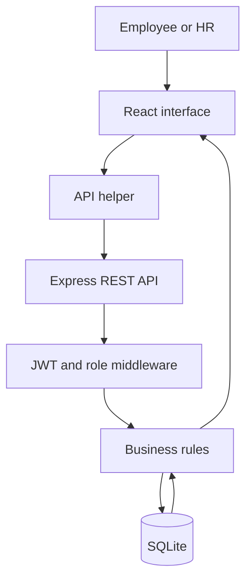

# Genesis code explanation

This guide explains the project in plain language so any team member can present it confidently.

## The one-sentence explanation

Genesis is a React interface that sends HTTP requests to an Express API; the API checks the user's JWT and role, applies business rules, reads or changes SQLite, and returns JSON that React displays.

## Architecture

There are three main layers:

1. **Client:** everything the user sees and clicks.
2. **Server:** API endpoints, validation, permissions, and business rules.
3. **Database:** permanent local records for employees, attendance, leave, payroll, and notifications.

## Root files

| File | What it does |
|---|---|
| `package.json` | Gives one set of commands for installing, seeding, developing, building, and starting the entire project. |
| `package-lock.json` | Locks dependency versions so every computer installs the same packages. |
| `.gitignore` | Keeps generated folders, the local database, secrets, and logs out of Git. |
| `README.md` | Project overview, requirements, setup commands, accounts, and API list. |

The root `npm run dev` command uses `concurrently` to start the server and client in the same terminal.

## Client files

### `client/index.html`

This is the single HTML page loaded by the browser. React attaches itself to `
`. It also sets the Genesis page title, description, theme colour, font, and favicon.

### `client/src/main.jsx`

This is the frontend entry point. It renders `App` and wraps it with:

- `BrowserRouter` for URL navigation
- `ToastProvider` for temporary success/error messages
- `AuthProvider` for the current login session

### `client/src/App.jsx`

This file defines the page routes.

- Logged-out users can only reach `/login` and `/signup`.
- Logged-in users enter the shared `Layout`.
- Employee and admin pages use the same URLs when the screen has two role-specific versions.
- `/employees` is admin-only on the client. An employee who tries it is redirected home.

The server still checks permissions. Client-side route hiding improves the experience but is not treated as security.

### `client/src/api.js`

This is the only place that directly uses `fetch`.

It:

1. Reads `genesis_token` from browser local storage.
2. Adds `Authorization: Bearer <token>` to requests.
3. Converts request objects to JSON.
4. Converts response JSON back into JavaScript objects.
5. Turns failed responses into predictable errors that pages can display.

Because all pages use this helper, authentication and error handling are consistent.

### `client/src/auth.jsx`

This file contains three shared systems.

#### Authentication context

- Restores a session through `GET /auth/me` after a refresh.
- Provides `login`, `signup`, `logout`, and `refreshUser` functions.
- Stores the current user so any page can check their name, ID, or role.

#### Toast context

- Displays small success and error messages.
- Removes each message automatically after 3.2 seconds.

#### Theme hook

- Switches light/dark mode by setting `data-theme` on the HTML element.
- Saves the user's choice under `genesis_theme`.

### `client/src/components/Layout.jsx`

This is the frame around every logged-in page.

- Displays the Genesis logo, sidebar, top bar, user avatar, theme button, and notification bell.
- Uses a different navigation list for employees and admins.
- Polls the notification endpoint every 15 seconds for the unread count.
- Becomes a slide-out menu on smaller screens.
- Renders the selected page inside React Router's `Outlet`.

### `client/src/components/ui.jsx`

This contains reusable presentation pieces:

- `Spinner` — loading indicator
- `StatCard` — dashboard number card
- `Badge` — coloured status label
- `EmptyState` — message for an empty list
- `Modal` — pop-up form or detail view
- `Field` — label, input, hint, and error wrapper
- Formatting helpers for money and dates

Using shared components keeps pages smaller and the interface consistent.

### `client/src/pages/Login.jsx`

- Collects email and password.
- Calls the shared `login` function.
- Shows an error when authentication fails.
- Includes one-click buttons that fill the two demo accounts.

### `client/src/pages/Signup.jsx`

- Collects employee ID, name, email, password, and role.
- Checks required fields, email format, password strength, and password confirmation before sending.
- Sends the final data to `POST /auth/signup`.

### `client/src/pages/Dashboard.jsx`

It selects a dashboard based on `user.role`.

**Admin dashboard:** headcount, present today, leave, pending approvals, attendance rate, a seven-day attendance chart, department distribution, and recent leave requests.

**Employee dashboard:** today's attendance state, check-in/out button, days present this month, leave balance, pending requests, leave progress bars, and recent activity.

### `client/src/pages/Employees.jsx`

Admin-only employee management.

- Search is debounced by 200 ms so it does not request on every instant keystroke.
- Department filtering is sent as an API query.
- Admin can add an employee, view full details, and edit authorised fields.
- A manually added employee receives a temporary password equal to their employee ID.

### `client/src/pages/Attendance.jsx`

It also selects a view by role.

**Employee view:** week/month filter, today's status, check-in/out, history, totals, and CSV export.

**Admin view:** date picker, company roster, attendance summary, manual status change, and CSV export.

The CSV is generated in the browser using a `Blob`; no extra library or server route is needed.

### `client/src/pages/Leave.jsx`

**Employee view:** shows leave balances and request history, and opens a form for a new request.

**Admin view:** filters pending/approved/rejected requests, opens a review modal, and sends an approval or rejection with a comment.

### `client/src/pages/Payroll.jsx`

**Employee view:** shows take-home pay, salary components, payslip history, and a printable payslip modal.

**Admin view:** shows total payroll, allows salary components to be edited, calculates the new net amount immediately, and generates a payslip.

### `client/src/pages/Profile.jsx`

- Loads the current employee's complete record.
- Lets the employee edit allowed personal fields.
- Shows job, salary, and document information as read-only sections where appropriate.

### `client/src/pages/Notifications.jsx`

- Lists the latest 30 notifications.
- Shows unread status.
- Allows one item or all items to be marked as read.

### `client/src/styles.css`

This is the design system for the entire interface.

- CSS variables hold Genesis colours, surfaces, borders, shadows, and spacing.
- `data-theme='dark'` replaces the relevant variables for dark mode.
- Shared classes style buttons, cards, forms, tables, navigation, modals, toasts, and grids.
- Media queries change the grids and sidebar for tablets and phones.

### `client/vite.config.js`

During development, Vite runs the frontend on port 5173. It proxies every `/api` request to Express on port 4000. The browser can therefore use simple relative URLs without hard-coding a server address.

## Server files

### `server/index.js`

This is the backend entry point.

It:

1. Loads environment variables.
2. Opens and initialises SQLite.
3. Enables JSON requests and CORS.
4. Logs each request in the terminal.
5. Mounts every route group under `/api`.
6. Serves the built React files in production.
7. Returns a safe generic response for unexpected server errors.

### `server/db.js`

- Opens one shared connection to `server/genesis.db`.
- Enables write-ahead logging (WAL) for reliable reads and writes.
- Enables foreign-key checks.
- Runs `schema.sql` on startup, so missing tables are created automatically.

Node's built-in `node:sqlite` keeps setup local and avoids a separate database installation.

### `server/schema.sql`

This describes the database structure.

| Table | Stores |
|---|---|
| `employees` | Login, role, profile, job information, salary structure, and status |
| `attendance` | One daily record per employee with times, hours, and status |
| `leave_requests` | Leave dates, reason, decision, reviewer, and comment |
| `leave_balances` | Total and used days for each leave type |
| `payslips` | A fixed salary snapshot for one employee and month |
| `notifications` | Employee alerts and unread state |
| `activity_log` | Recent actions shown on the employee dashboard |

Foreign keys keep related data connected. Unique constraints prevent duplicate employee codes, emails, daily attendance records, balances, and monthly payslips. Indexes speed up common attendance, leave, and notification queries.

### `server/seed.js`

This is the fake-database generator.

It clears old demo records and creates:

- One HR/admin account
- Twelve employee accounts across several departments
- Salary structures and document names
- Four leave balances for every account
- Previous attendance history plus realistic current-day company attendance
- Pending, approved, and rejected leave examples
- Two months of payslips
- Notifications and activity records

Aarav intentionally has no current-day attendance, so the check-in action always works after a fresh seed. Aarav also has a pending request, which lets the video show an admin decision followed by an employee notification.

### `server/auth-middleware.js`

- `signToken` creates a JWT containing the employee's ID, role, code, and name. It expires after seven days.
- `requireAuth` checks the Bearer token and attaches the verified data to `req.user`.
- `requireAdmin` returns HTTP 403 unless the verified role is `admin`.

### `server/validators.js`

Small reusable functions validate email, password, date, non-empty text, and inclusive leave duration. Important input is validated again on the server because browser checks can be bypassed.

## Route files

| Route file | Responsibility |
|---|---|
| `routes/auth.js` | Sign-up, password hashing, login, JWT creation, session restore, starting leave balances, and welcome notification |
| `routes/employees.js` | Admin directory/search/add/edit and self-profile access with different editable-field lists |
| `routes/attendance.js` | Check-in, check-out, work-hour calculation, employee history, admin roster, and status override |
| `routes/leave.js` | Employee balances/requests, new requests, admin list, approval/rejection, balance update, attendance update, and notification |
| `routes/payroll.js` | Employee salary/payslips, company payroll list, salary update, payslip generation, and notification |
| `routes/dashboard.js` | Employee summaries and admin analytics calculated directly from current database data |
| `routes/notifications.js` | Latest notifications, unread count, and read actions |

## Important workflows

### Login

1. Login page sends email and password to `/api/auth/login`.
2. Server finds the employee and compares the password against the bcrypt hash.
3. Server returns a signed JWT and safe user data without the password hash.
4. Browser stores the JWT.
5. Later requests automatically include it.

### Employee check-in and check-out

1. Employee clicks the dashboard or attendance button.
2. Server uses the ID from the verified JWT, not an ID supplied by the browser.
3. Check-in creates today's row and an activity entry.
4. Check-out calculates hours from the two times.
5. Fewer than four hours becomes `half-day`; otherwise it remains `present`.

### Leave request and approval

1. Employee submits type, start date, end date, and reason.
2. Server validates the dates, calculates inclusive days, and checks the available balance.
3. The request is stored as `pending`.
4. HR reviews it.
5. Approval runs in a database transaction: request status, leave balance, attendance dates, and notification all succeed together or all roll back.
6. The employee sees the result in notifications and updated balances.

### Payslip generation

1. HR maintains four values: basic, HRA, allowances, and deductions.
2. Net salary is `basic + HRA + allowances - deductions`.
3. Generate Payslip stores a monthly snapshot, so later salary edits do not rewrite the old payslip.
4. A unique rule prevents two payslips for the same employee and month.
5. The employee receives a notification and can print/save the slip as PDF.

## Prepared answers for judges

### Why SQLite?

It provides real persistent relational data while keeping the project completely local and easy to run. No database account, network, or separate service is required.

### Why React?

The application has several interactive role-based screens. React components and shared state keep navigation, forms, loading, and reusable UI manageable.

### Why Express?

Express makes the API routes and middleware easy to separate by feature. This keeps business rules away from the UI and makes the architecture scalable.

### How is this dynamic instead of static JSON?

Every dashboard number, row, balance, status, and notification is queried from SQLite. User actions write to the database, and later screens immediately read the changed values.

### How is security handled?

Passwords are bcrypt hashes, sessions use signed JWTs, protected routes verify tokens, admin routes verify the role, prepared SQL statements pass user values separately, and the password hash is removed from responses.

### Why validate twice?

Frontend validation gives fast feedback. Server validation is the real protection because a user can bypass the browser and call an API directly.

### What would you improve for production?

Use secure admin invitations, password reset and email verification, stricter rate limiting, HTTPS, a production secret manager, database migrations, automated tests, audit logs, real document storage, and organisation-level multi-tenancy.
